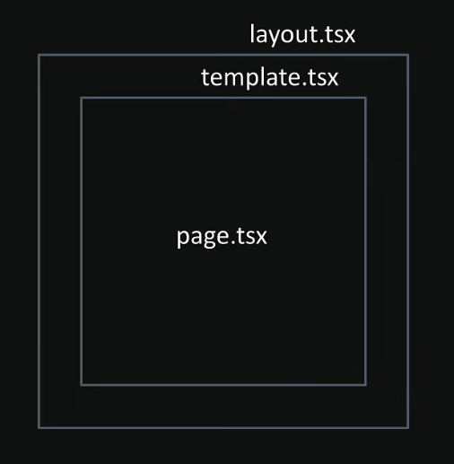

# Templates

- Templates are **similar to layouts** in that they are also **UI shared between multiple pages** in your app.

- Whenever a **user navigates between routes** **sharing a template**, you get a **completely fresh start**.

- Alternative of **layout** files.

    - used in the app router that wraps child layouts or pages and creates a **new instance** of its components on navigation.
    - DOM elements are recreated.
    - States is cleared
    - Effects are re-syncronized

## Creating Templates and Usage:

- To create a template by **exporting a default React component** from a **template.js** or **template.tsx**

- Like layouts, templates need to accept a **children prop** to **render the nested route** segments.

## When to Use a Template (vs. Layout):

- Use a template primarily when you need a component's state or effects (like useEffect) to run on every navigation event, as a new instance of the component is mounted each time. 

- For shared, persistent UI (e.g., header/footer/sidebar): Use a layout.js file. Layouts are persistent, preserve state, and are more performant for static UI.
- For effects that need to re-run on navigation (e.g., logging page views, page transition animations): Use a template.js file.
- To reset state on navigation (e.g., a feedback form that should be cleared for each page): Use a template.js file. 

## Layout and Template.jsx (together):

