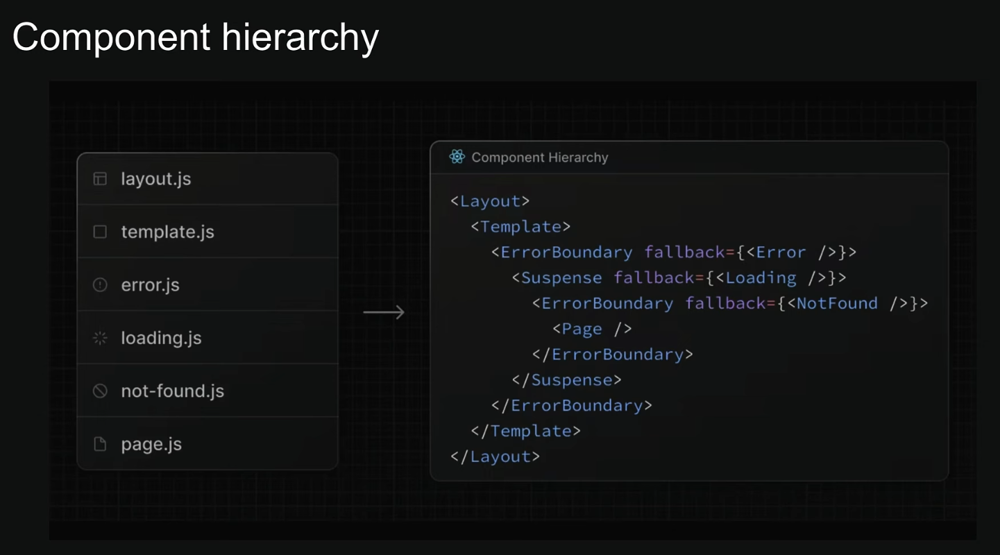

# Error Handling

* Error is **managed through special files** that create React Error Boundaries to gracefully handle unexpected **runtime errors in nested routes**.


## File Conventions for Error Handling:

* Next.js provides several file conventions to handle errors at different levels of granularity: 

    * **error.tsx:**  
        * It is a client component, so use **"use client"**. 
        * This file automatically **creates a React Error Boundary** that wraps a nested child segment or page.tsx component.

        * It **renders a fallback UI** when an error is thrown within its boundary, isolating the error to that specific part of the application.

        * It **receives error** and **reset props**.
        
        * The **reset function** allows users to **attempt to recover from the error** by **re-rendering the boundary's contents**.

        * **error.tsx** components must be client components and include the 'use client' directive.

        * **Example:**
        ```tsx
        "use client";

        export default function error({ error }: {
            error: Error
        }) {
            return (
                <div>
                    <h2>Intentional Error occur</h2>
                    <p>Error: {error.message}</p>
                </div>
            );
        }
        ```

## Component Hierarchy:

