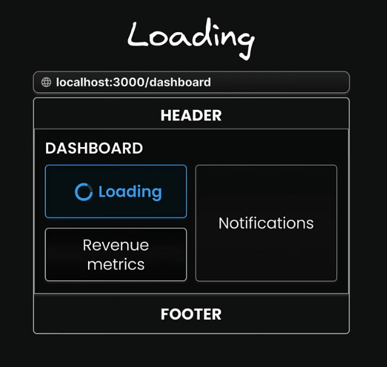
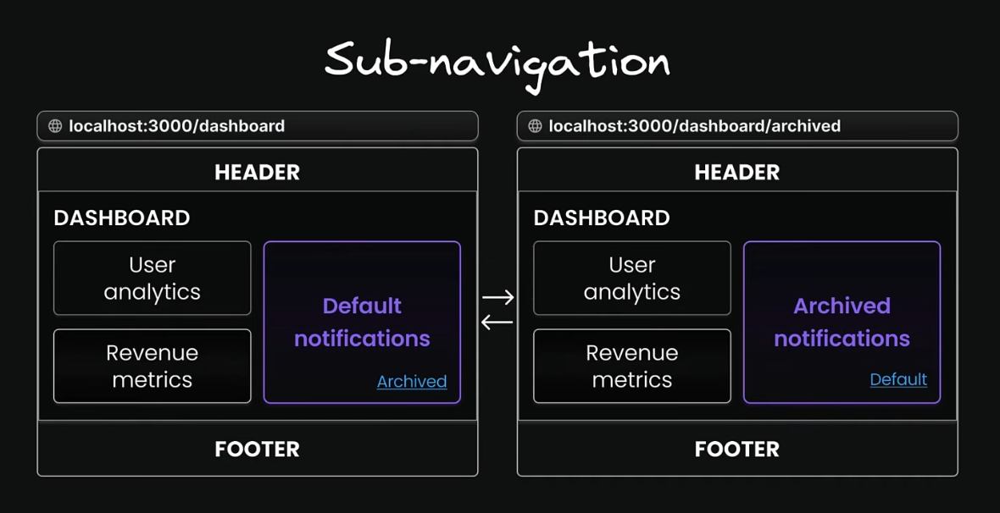

# Parallel Routes

## What parallel routes are:

- Parallel routes is an **advanced routing machanism**.
- Allow for **simultaneously** or **conditionally rendering multiple pages** (or independent sections) within the **same layout**.

* This feature is particularly useful for **complex applications** like *dashboards*, *social media feeds*, or *modals*.
* It enables **independent loading**, **error handling**, and **sub-navigation** for each section. 

### Example:

## Key Concepts:

* **Slots:** Parallel routes are **defined using "`named slots`"** which are folders prefixed with the `@` symbol (e.g., *@team*, *@analytics*).

* **Layout Props:** These **slots** are **passed as props** to their **parent `layout.tsx` file**, where they can be rendered in parallel alongside the default children prop (which is an implicit slot).

* **Independent Behavior:** Each slot operates as an independent route with its own state management, data fetching, loading.tsx, and error.tsx files. This allows one section of the UI to load or encounter an error without affecting other parts of the page.

* **URL Structure:** Slot names (**@folder**) do **not affect the URL structure**. For example, a file at `app/@dashboard/views/page.tsx` will be accessible at `/views`. 

## Parallel routes benefits:

1. Parallel routes are great for splitting a layout into menageable slots
    (specially when different teams work on different parts).

2. **Independent route handling**:
    * Each slot in your layout, such as users, revenue, and notifications, can handle its **own loading** and **error states**.

    * This granular control is particularly useful in scenarios where different sections of the page load at varying speeds or encounter unique errors. 

    * **Example:**  
    
    
    

3. **Sub-navigation:** 
    * Each slot can essentially function as a mini-application, complete with its own navigation and state management.

    * Users can **interact with each section separately**, **applying filters**, **sorting data**, or **navigating through pages** ***without affecting other parts***.

    * **Example:**  
    

### Source:
[YouTube - Codevolution](https://youtu.be/697kNwfU-4M?list=PLC3y8-rFHvwhIEc4I4YsRz5C7GOBnxSJY)