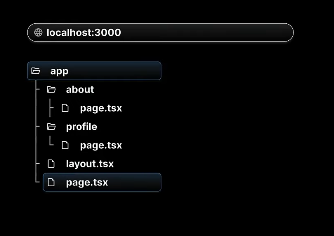

## Routing in Next.js:

* Next.js is using file-based routing system.
* URLs you can access in your browser are determined by how you **organize your files**, and **folders** in your code.
* Folders in **App directory** can accessible with Routing.

## Structure of File-based routing:

