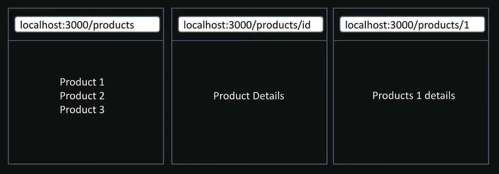
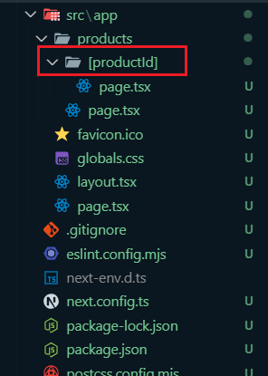

# Dynamic Routing

## Scenario

## How to Create Dynamic Routing?

* To create a dynamic route, wrap the folder name in square brackets (e.g., [slug] or [id]) inside the app directory. 

* Now we can use unlimited routes: **/products/2**, **/products/3**, **/products/hello**, etc.