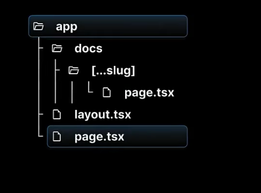

# Catching all Segments in NextJS

* catch-all segments allow a single route to **handle multiple URL paths**.
* by creating a **special folder name** with an ellipsis inside square brackets: **[...slug]**. 
* This is particularly useful for dynamic content like documentation pages, blogs, or e-commerce sites **where the URL structure can vary**.

## File Structure:

